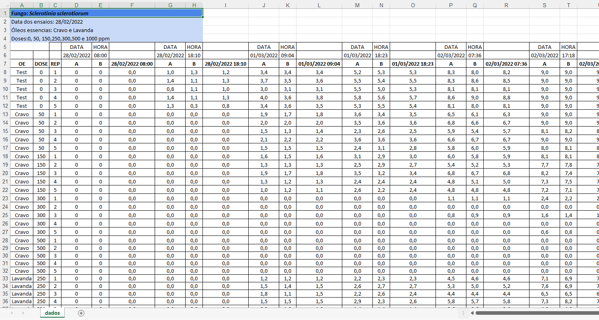

```{r, include=FALSE}
library(tidyverse)
library(phytopathologyr)
```


# Área Abaixo da Curva de Crescimento Micelial - AACCM {#aaccm}

É um conceito da epidemiologia que analisa o crescimento da doença em função do tempo.

É feita pela quantificação da área uma gráfico que expressa a evolução da quantidade de doença (*eixo x*) em função do tempo (*eixo y*).

No caso do crescimento micelial, observado em placas de Petri, a quantidade de doença é medida pelo diâmetro ou raio da colônia.

Na figura abaixo é mostrado um exemplo de uma curva de progresso da doença.

```{r curvaprog, echo=FALSE, fig.cap="Exemplo de uma curva de progresso da doença."}
tempo <- c(0, 1, 2, 3, 5, 6, 7, 8)
diam <- c(0.5, 0.6, 0.7, 1.2, 3.1, 5.2, 6.6, 8.8)

library(ggplot2)
ggplot(data.frame(diam, tempo), aes(x = tempo, y = diam)) +
  geom_line() +
  geom_point()
```


A área abaixo da curva pode ser calculada pelo método dos trapézios, cuja fórmula é a seguinte:

$$
AAC = \frac{1}{2} \sum ((X_{i+1}+X_i) \cdot (T_{i+1}-T_i))
$$

No software R, existe a função `audpc` do pacote `phytopathologyr` que efetua este cálculo

A função precisa de dois vetores:

1. Tempo em que cada medida foi realizada (no exemplo abaixo, dias após a repicagem da colônia).
2. Quantificação da doença (no exemplo abaixo, o diâmetro da colônia em cada tempo.)

```{r}
tempo <- c(0, 1, 2, 3, 5, 6, 7, 8)
diam <- c(0.5, 0.6, 0.7, 1.2, 3.1, 5.2, 6.6, 8.8)
library(phytopathologyr)
audpc(y = diam, time = tempo)
```

## Como utilizar a AACCM na análise de experimentos {#aaccmexp}

 A AACCM é um valor único que integra a evolução da curva de progresso da doença em todo o tempo de avaliação.
 
::: {.rmdwarning}

As curvas de progressos só podem ser comparadas entre si quando tem exatamente o mesmo tempo de duração, isto é, o tempo de avaliação deve ser exatamente igual.

:::
 
 Em experimentos comparativos, devemos calcular a AACCM para cada repetição de cada tratamento, afim de prossegurimos com as análises estatísticas posteriormente.
 
 O primeiro passo é digitar os seus dados em um formato organizado e passível de leitura pelo software R. Vou exemplificar a digitação em uma planilha do Excel, pois é o formato amplamente utilizado em nosso laboratório.
 
 A planilha do Excel deve ser organizada da seguinte forma:
 
```{r excelaaccm, echo=FALSE, fig.cap="Exemplo de planilha do Excel"}

```
 

 
 
 É recomendável utilizar as primeiras linhas para fazer uam descrição dos dados apresentadas (metadados). Utilize quantas linhas desejar, pois estas serão ignoradas no momento da importação da planilha para o R. Neste exemplo, as 6 primeiras linhas são auxiliares, e os dados propriamente ditos começam na linha 7.
 
 As primeiras colunas devem conter os tratamentos ou fatores e as repetições.
 
 As colunas seguintes seguem um padrão: primeira medida do diâmetro (A), segunda medida do diâmetro (B) e média destas duas medidas. Esta última recebe no cabeçalho o momento em que foi efetuada a medição, seja a data, data e hora, a depender do planejamento do seu experimento. 
 
 Com a planilha do Excel devidamente preenchida e todos os valores conferidos, podemos seguir com a importação desta para o ambiente do R. 
 
 [Uma planilha de exemplo está aqui para download.](data/aaccm.xlsx)
 
 Para isso, utilizamos a função `read_excel` do pacote `readxl`
 
```{r}
dados_aaccm <- readxl::read_excel("data/aaccm.xlsx", skip = 6)
```


```{r, echo=FALSE}
dplyr::glimpse(dados_aaccm)
```
 
 Na sequência, devemos "limpar" as colunas que não precisamos com as funções dos  pacotes `dplyr` e `tidyr`. Este passo é bastante variável em função da forma como os dados foram organizados/digitados anteriormente. Vou exemplificar conforme a planilha do Excel mostrada na figura \@ref(fig:excelaaccm).
 


```{r}
library(dplyr)
library(tidyr)

dados_aaccm <- dados_aaccm %>%
  select(!starts_with(c("a", "b"))) %>%
  pivot_longer(4:length(.), names_to = "tempo", values_to = "diametro") %>%
  mutate(tempo = as.numeric(tempo))
```

```{r, echo=FALSE}
dplyr::glimpse(dados_aaccm)
```


Após estas instruções, é possível calcular a AACCM para cada repetição de cada tratamento, com a função `audpc` do pacote `phytopathologyr` da seguinte forma: 

```{r}
library(phytopathologyr)
dados_aaccm <- dados_aaccm %>%
  group_by(oe, dose, rep) %>%
  summarise(area = audpc(diametro, tempo)) %>%
  ungroup()

```

```{r, echo=FALSE}
dplyr::glimpse(dados_aaccm)
```

Por fim, o resultado destes cálculos pode ser salvo para utilização nas análises posteriores. O formato *.csv* é idela para salvar, visto que sua importação pelo R é facilmente executado e pode ser aberto em qualquer computador para leitura.

```{r}
readr::write_csv2(dados_aaccm, "data/area.csv")
```
