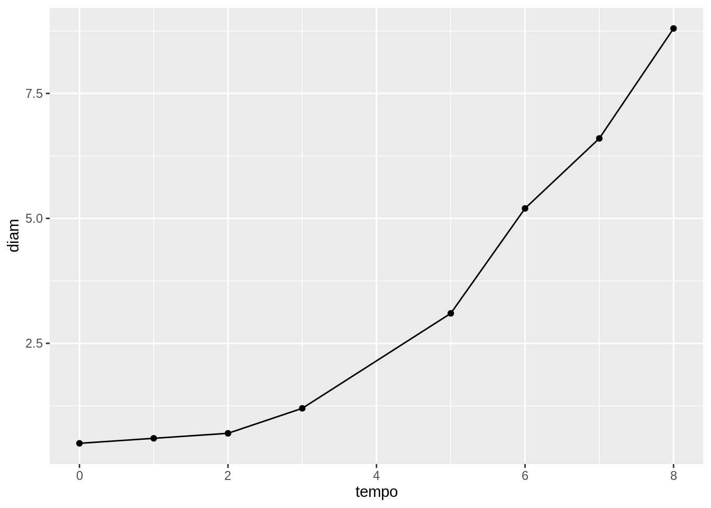
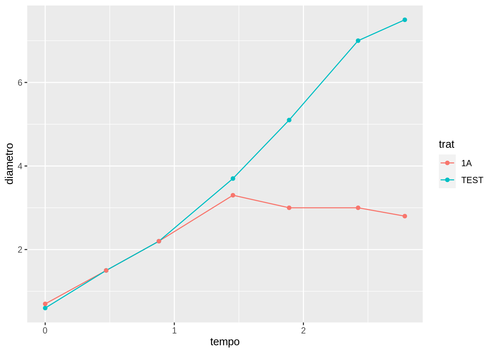

# Área Abaixo da Curva de Crescimento Micelial - AACCM {#aaccm}

É um conceito da epidemiologia que analisa o crescimento da doença em função do tempo.

É feita pela quantificação da área uma gráfico que expressa a evolução da quantidade de doença (*eixo x*) em função do tempo (*eixo y*).

No caso do crescimento micelial, observado em placas de Petri, a quantidade de doença é medida pelo diâmetro ou raio da colônia.

Na figura abaixo é mostrado um exemplo de uma curva de progresso da doença.

<div class="figure">

<p class="caption">(\#fig:curvaprog)Exemplo de uma curva de progresso da doença.</p>
</div>


A área abaixo da curva pode ser calculada pelo método dos trapézios, cuja fórmula é a seguinte:

$$
AAC = \frac{1}{2} \sum ((X_{i+1}+X_i) \cdot (T_{i+1}-T_i))
$$

No software R, existe a função `audpc` do pacote `phytopathologyr` que efetua este cálculo

A função precisa de dois vetores:

1. Tempo em que cada medida foi realizada (no exemplo abaixo, dias após a repicagem da colônia).
2. Quantificação da doença (no exemplo abaixo, o diâmetro da colônia em cada tempo.)


```r
tempo <- c(0, 1, 2, 3, 5, 6, 7, 8)
diam <- c(0.5, 0.6, 0.7, 1.2, 3.1, 5.2, 6.6, 8.8)
library(phytopathologyr)
audpc(y = diam, time = tempo)
```

```
## [1] 24.2
```

## Como utilizar a AACCM na análise de experimentos {#aaccmexp}

 A AACCM é um valor único que integra a evolução da curva de progresso da doença em todo o tempo de avaliação.
 
::: {.rmdwarning}

As curvas de progressos só podem ser comparadas entre si quando tem exatamente o mesmo tempo de duração, isto é, o tempo de avaliação deve ser exatamente igual.

:::
 
 

```
## New names:
## • `x` -> `x...4`
## • `x` -> `x...6`
## • `x` -> `x...8`
## • `x` -> `x...10`
## • `x` -> `x...12`
## • `x` -> `x...14`
## • `x` -> `x...16`
```




 Em experimentos comparativos, devemos calcular a AACCM para cada repetição de cada tratamento, afim de prossegurimos com as análises estatísticas posteriormente.
 
 O primeiro passo é digitar os seus dados em um formato organizado e passível de leitura pelo software R. Vou exemplificar a digitação em uma planilha do Excel, pois é o formato amplamente utilizado em nosso laboratório.
 
 A planilha do Excel deve ser organizada da seguinte forma:
 
<div class="figure">

<p class="caption">(\#fig:excelaaccm)Exemplo de planilha do Excel</p>
</div>
 

 
 
 É recomendável utilizar as primeiras linhas para fazer uam descrição dos dados apresentadas (metadados). Utilize quantas linhas desejar, pois estas serão ignoradas no momento da importação da planilha para o R. Neste exemplo, as 6 primeiras linhas são auxiliares, e os dados propriamente ditos começam na linha 7.
 
 As primeiras colunas devem conter os tratamentos ou fatores e as repetições.
 
 As colunas seguintes seguem um padrão: primeira medida do diâmetro (A), segunda medida do diâmetro (B) e média destas duas medidas. Esta última recebe no cabeçalho o momento em que foi efetuada a medição, seja a data, data e hora, a depender do planejamento do seu experimento. 
 
 Com a planilha do Excel devidamente preenchida e todos os valores conferidos, podemos seguir com a importação desta para o ambiente do R. 
 
 [Uma planilha de exemplo está aqui para download.](data/pareamento.xlsx)
 
 Para isso, utilizamos a função `read_excel` do pacote `readxl`
 

```r
dados_aaccm <- readxl::read_excel("data/pareamento.xlsx", skip = 6)
```

```
## New names:
## • `x` -> `x...4`
## • `x` -> `x...6`
## • `x` -> `x...8`
## • `x` -> `x...10`
## • `x` -> `x...12`
## • `x` -> `x...14`
## • `x` -> `x...16`
```


```
## Rows: 50
## Columns: 16
## $ trat                 <chr> "TEST", "TEST", "TEST", "TEST", "TEST", "111B", "…
## $ rep                  <dbl> 1, 2, 3, 4, 5, 1, 2, 3, 4, 5, 1, 2, 3, 4, 5, 1, 2…
## $ `44585.888888888891` <dbl> 0.6, 0.6, 0.5, 0.5, 0.5, 0.8, 0.7, 0.7, 0.6, 0.6,…
## $ x...4                <dbl> NA, NA, NA, NA, NA, 0.0, 0.0, 0.0, 0.0, 0.0, 0.4,…
## $ `44586.361111111109` <dbl> 1.5, 1.6, 1.5, 1.4, 1.4, 1.5, 1.5, 1.5, 1.4, 1.2,…
## $ x...6                <dbl> NA, NA, NA, NA, NA, 0.4, 0.0, 0.0, 0.0, 0.0, 0.7,…
## $ `44586.769444444442` <dbl> 2.2, 2.4, 2.2, 2.1, 2.1, 2.4, 2.3, 2.2, 2.2, 2.3,…
## $ x...8                <dbl> NA, NA, NA, NA, NA, 0.5, 0.4, 0.4, 0.3, 0.4, 1.1,…
## $ `44587.343055555553` <dbl> 3.7, 3.9, 3.7, 3.6, 3.6, 4.0, 3.9, 3.7, 3.7, 3.8,…
## $ x...10               <dbl> NA, NA, NA, NA, NA, 0.8, 0.7, 0.7, 0.6, 0.6, 1.8,…
## $ `44587.77847222222`  <dbl> 5.1, 5.3, 5.1, 4.9, 4.9, 4.8, 4.7, 4.9, 4.6, 5.0,…
## $ x...12               <dbl> NA, NA, NA, NA, NA, 1.0, 1.0, 0.9, 0.8, 0.8, 2.0,…
## $ `44588.3125`         <dbl> 7.0, 7.0, 7.0, 6.8, 6.8, 5.0, 5.0, 5.9, 5.1, 5.5,…
## $ x...14               <dbl> NA, NA, NA, NA, NA, 1.3, 1.1, 1.1, 0.9, 1.0, 2.1,…
## $ `44588.674305555556` <dbl> 7.5, 7.5, 7.5, 7.4, 7.3, 4.9, 5.0, 5.6, 4.8, 5.5,…
## $ x...16               <dbl> NA, NA, NA, NA, NA, 1.3, 1.3, 1.1, 1.0, 1.0, 2.2,…
```
 
 Na sequência, devemos "limpar" as colunas que não precisamos com as funções dos  pacotes `dplyr` e `tidyr`. Este passo é bastante variável em função da forma como os dados foram organizados/digitados anteriormente. Vou exemplificar conforme a planilha do Excel mostrada na figura \@ref(fig:excelaaccm).
 


```r
library(dplyr)
library(tidyr)

dados_aaccm <- dados_aaccm %>%
  select(!starts_with("x")) %>%
  pivot_longer(3:length(.), names_to = "tempo", values_to = "diametro") %>%
  mutate(tempo = as.numeric(tempo) - as.numeric(tempo[1]))
```


```
## Rows: 350
## Columns: 4
## $ trat     <chr> "TEST", "TEST", "TEST", "TEST", "TEST", "TEST", "TEST", "TEST…
## $ rep      <dbl> 1, 1, 1, 1, 1, 1, 1, 2, 2, 2, 2, 2, 2, 2, 3, 3, 3, 3, 3, 3, 3…
## $ tempo    <dbl> 0.0000000, 0.4722222, 0.8805556, 1.4541667, 1.8895833, 2.4236…
## $ diametro <dbl> 0.6, 1.5, 2.2, 3.7, 5.1, 7.0, 7.5, 0.6, 1.6, 2.4, 3.9, 5.3, 7…
```


Após estas instruções, é possível calcular a AACCM para cada repetição de cada tratamento, com a função `audpc` do pacote `phytopathologyr` da seguinte forma: 


```r
library(phytopathologyr)
dados_aaccm <- dados_aaccm %>%
  group_by(trat, rep) %>%
  summarise(aaccm = audpc(diametro, tempo)) %>%
  ungroup()
```

```
## `summarise()` has grouped output by 'trat'. You can override using the
## `.groups` argument.
```


```
## Rows: 50
## Columns: 3
## $ trat  <chr> "102B", "102B", "102B", "102B", "102B", "111B", "111B", "111B", …
## $ rep   <dbl> 1, 2, 3, 4, 5, 1, 2, 3, 4, 5, 1, 2, 3, 4, 5, 1, 2, 3, 4, 5, 1, 2…
## $ aaccm <dbl> 9.997049, 10.212813, 9.636563, 10.291319, 10.246111, 9.498368, 9…
```

Por fim, o resultado destes cálculos pode ser salvo para utilização nas análises posteriores. O formato *.csv* é idela para salvar, visto que sua importação pelo R é facilmente executado e pode ser aberto em qualquer computador para leitura.


```r
readr::write_csv2(dados_aaccm, "data/aaccm.csv")
```
